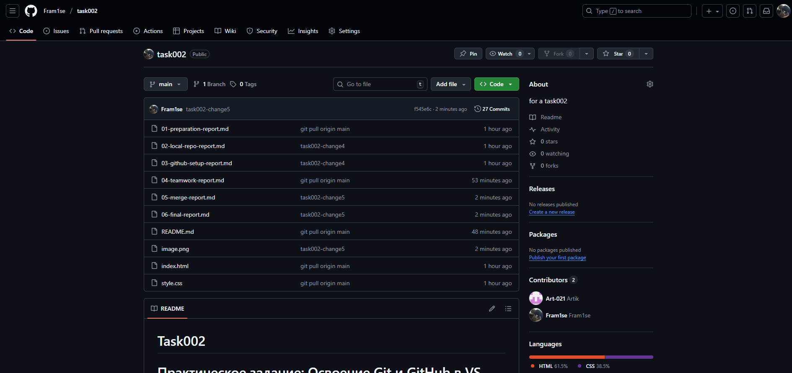

# Отчет по настройке GitHub

**Дата:** [29.09.2025]  
**Команда:** [Александр] и [Артем]

## Выполненные действия:

### Шаг 2.1: Создание репозитория на GitHub
- URL репозитория: [https://github.com/Fram1se/task002.git]
- Видимость: Public
- [x] Репозиторий создан без README

### Шаг 2.2: Связывание репозиториев
- [x] Команда git remote add выполнена
- [x] Ветка переименована в main
- [x] Push выполнен успешно

## Проверка:
1. Откройте репозиторий на GitHub
2. [x] Файлы index.html, style.css, README.md отображаются
3. [x] История коммитов показывает "Initial commit"

## Скриншоты:
[]

## Проблемы и решения:
[Опишите проблемы при связывании репозиториев]

## Вывод:
[Что узнали о работе с удаленными репозиториями]