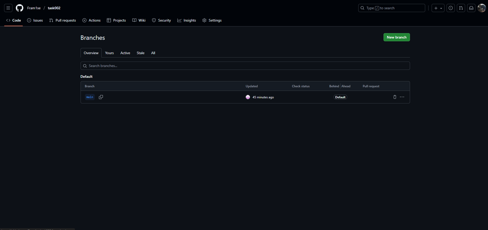

# Отчет по слиянию изменений

**Дата:** [29.09.2025]
**Команда:** [Александр] [Артём]

## Выполненные действия:

### Pull Requests:
- PR студента 1: [ссылка на PR] ✅
- PR студента 2: [ссылка на PR] ✅

### Code Review:
- [ ] Оба PR проверены
- [ ] Оба PR approved

### Слияние:
- [ ] Оба PR успешно слиты в main
- [ ] Ветки удалены на GitHub (опционально)

### Обновление локальной копии:
- [x] Локальная ветка main обновлена
- [x] Все изменения присутствуют

## Проверка финального результата:
1. Откройте index.html в браузере
2. [x] Раздел "Навыки" отображается
3. [x] Форма "Контакты" отображается
4. [x] Все стили работают корректно

## Скриншоты:
[]

## Проблемы и решения:
[Опишите проблемы при слиянии и как их решили]

## Вывод:
[Что узнали о процессе Code Review и слиянии изменений]